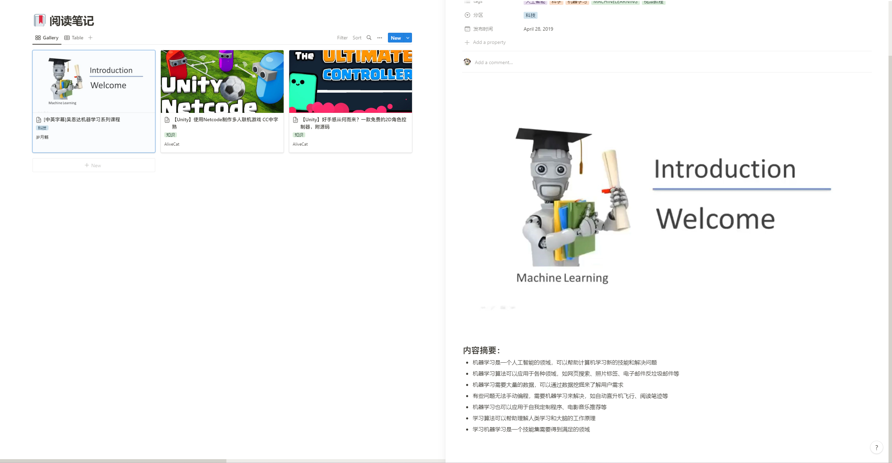

# ChatGPT Summarizing Bilibili Video to Notion

一款使用 chatGPT 总结 b 站视频内容到 Notion 的 python 命令行工具。通过爬取 b 站的 cc 字幕，然后送到 chatGPT 当中获得汇总文本，再写入 Notion。是对[段小草](https://zhuanlan.zhihu.com/p/610250035)发布在知乎的文章内的程序的改进



原作者 gist：[https://gist.github.com/loveQt/1714808c6ee8b732596ecb6e38c23ea7](https://gist.github.com/loveQt/1714808c6ee8b732596ecb6e38c23ea7)

## Quick Start

你需要准备：

- 一个能打开 cc 字幕的 b 站视频，该工具建立在 b 站的字幕上，如果没有则无法工作

- **chatGPT API key** : 在 [这里](https://platform.openai.com/account) 申请 chatGPT API Key，并将该值配置在 `settings.json` 文件的 `api_key` 字段

- **Notion token** : 在 [这里](https://platform.openai.com/account) 创建 Notion integrations token
，并将该值配置在 `settings.json` 文件的 `notion_token` 字段

- **Notion database id** : 在你的 Notion 笔记本当中创建一个 database，这个 database 的格式如下所示（你可以新增或减少这些字段）。在 右上角下拉菜单/Add connections 当中找到刚刚创建的 integrations，点击加入。通过分享按钮获得 database 的链接，其链接的 endpoint 即为这个 database 的 id。将其复制在 `settings.json` 的 `database_id` 中

| 名称 | 类型 |
| --- | --- |
| 标题 | title |
| URL | url |
| UP主 | text |
| 分区 | select |
| tags | multi select |
| 发布时间 | date |

在控制台运行 `main.py`：

```base
python main.py
```

等待片刻后输出：

```
请输入BV号：BV14S4y1o79L
开始处理：BV14S4y1o79L
获取到视频信息：【Unity】好手感从何而来？一款免费的2D角色控制器，附源码
字幕获取成功，chatGPT开始编写摘要
chatGPT编写摘要成功
导入Notion成功
```

有些时候（遇到自动生成的字幕时）会要求你输入 cookie，你需要按下 F12 打开控制台，找到 Network，并搜索 https://api.bilibili.com/x/player/v2 这个接口，将其请求头当中的 cookie 复制后填入这里。程序会在本地保存 cookie 的内容，这样不需要每次请求都要手动输入一次。

## Commands

```
python main.py --help

options:
  -h, --help            show this help message and exit
  --bv BV               获取bv号
  -p P                  分p，默认为0
  --summary_count SUMMARY_COUNT
                        需要的精简概括的数量（默认为10条）
```